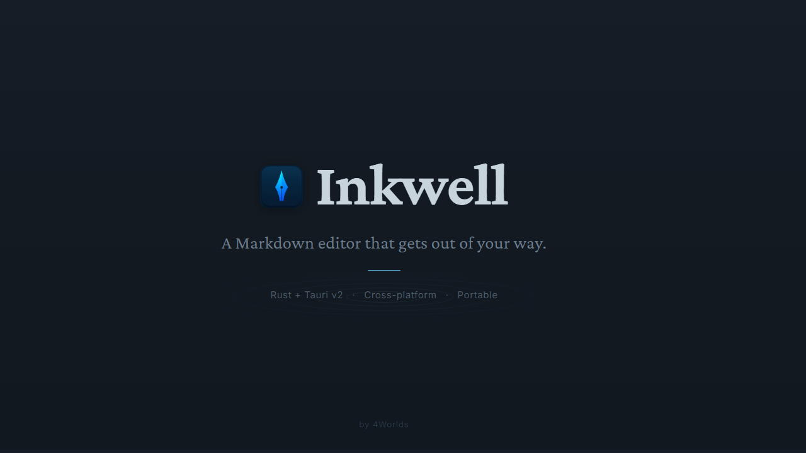
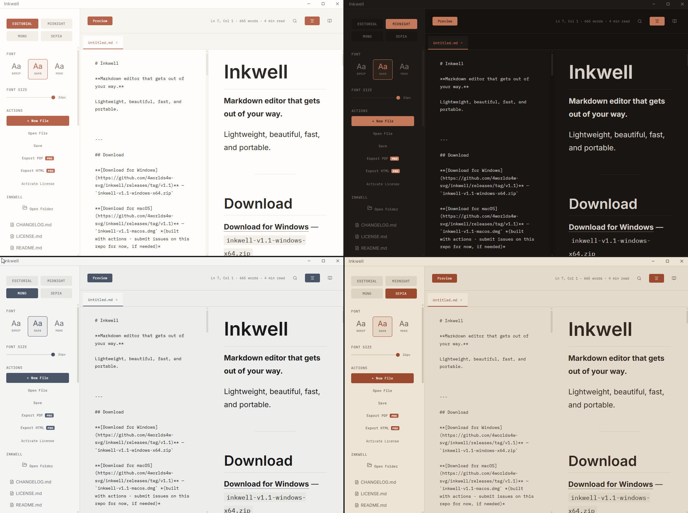

# Inkwell

**Markdown editor that gets out of your way.**

Lightweight, beautiful, fast, and portable.



---

## Download

**[Download for Windows](https://github.com/4worlds4w-svg/inkwell/releases/tag/v1.0.0)** — `inkwell.exe` (11 MB)

**[Download for Linux](https://github.com/4worlds4w-svg/inkwell/releases/tag/v1.0.0)** — `inkwell` (8.5 MB)

---

## Getting Started

**Windows:** Download `inkwell.exe`. Double-click. Start writing.

> Windows SmartScreen may warn you on first launch, this is expected for unsigned apps. Click **"More info"** → **"Run anyway"**.

**Linux:** Download, then:
```bash
chmod +x inkwell
./inkwell
```

---

## Features

**Editor** — Split view with a draggable divider. Live preview as you type. Current line highlight with accent-colored cursor.

**4 Themes** — Editorial (warm cream), Midnight (dark mode), Mono (black & white), Sepia (vintage warmth).

**3 Font Families** — Crimson Pro (serif), Inter (sans), IBM Plex Mono. Adjustable size from 14–24px.

**Focus Mode** — One click to hide everything except your words. Press Esc to return.

**Markdown** — Full GitHub Flavored Markdown. Syntax highlighting for 30+ languages. Copy buttons on code blocks. Styled tables, blockquotes, and checklists.

**Files** — Tabbed editing. Drag & drop. Auto-save on every keystroke. Recent files. Native save dialogs.

**Images** — Paste from clipboard or drag onto the editor. Large images auto-resized. Stored as data URLs, fully portable.

**Templates** — 10 built-in templates + save your own.

**Table of Contents** — Auto-generated from headings. Click to jump. Active section highlighted.

**Version History** — Auto-snapshots every 5 minutes. One-click restore.

**Search** — Ctrl+F across your document. Match highlighting and navigation.

---

## Pro License

Inkwell is **free to use forever**. Write, preview, switch themes, use templates, all of it.

**PDF and HTML exports** require a one-time Pro license. No subscription.

**[Get a Pro license on Gumroad →](https://4worlds.gumroad.com/l/inkwell)**  (FREE for the first 100 people)

---

## Technical Details

| | |
|-|-|
| **Size** | 11 MB (Windows) · 8.5 MB (Linux) |
| **Built with** | Rust + Tauri v2 (not Electron) |
| **Startup** | < 1 second |
| **Tested with** | 65,000+ word documents |
| **Data storage** | Local only. Nothing leaves your machine. |

---

## What's Coming

| Version | Features |
|---------|----------|
| v1.1 | Find & Replace, typewriter mode |
| v1.2 | Command palette, Vim keybindings |
| v1.3 | Mermaid diagrams, LaTeX math |
| v1.4 | macOS, custom themes, manual update check |

---

## Philosophy

Inkwell is the first release from **4Worlds**, a small independent software studio building tools that respect the people who use them.

No cloud. No telemetry. No accounts. No subscriptions. Just software you own, on hardware you control.

We ship tools we'd want to use ourselves.

We also believe the best tools are quiet, fast, and permanent. Inkwell is the first. More are coming.


